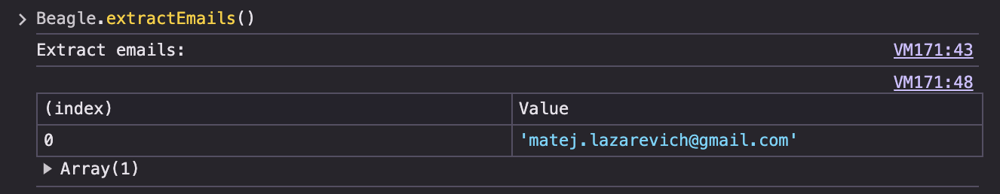

# beagle.js 🐶

beagle.js is a collection of lightweight JavaScript functions designed for quick and simple inspection of web pages. Each function is designed to be copy-pasted directly into a browser's console, giving instant insights into various aspects of the loaded webpage.

Please be aware that the provided functions are designed for quick insights rather than comprehensive analysis. They may not account for every edge case or intricacy of web page structure.

## 🚀 Getting Started

1. Navigate to the web page you wish to inspect.
2. Open your browser's developer tools.
3. Navigate to the 'Console' tab.
4. Copy the contents of `beagle.js` file from this repository and paste it into the console. Press `Enter`. Invoke it with `Beagle.functionName();`

## 📜 Scripts

### `findInjectionPoints()`

Scours the webpage for common points that might be susceptible to injections such as input fields, buttons, and more. Returns a table-format report of all elements discovered with their respective properties.

### `findLinks()`

Identifies all anchor (<a>) tags on the webpage, categorizing them based on their URLs. Returns a table-format report detailing each link's URL, anchor text, and a flag indicating if it's external.

### `extractEmails()`
Extracts email addresses found within the text content of the webpage. Utilizes a regular expression to match email patterns and returns a unique list of emails found.

### `findHtmlComments()`
Searches the webpage for HTML comments and logs them in the console. Uses a NodeIterator to traverse the DOM and collect comments.

### `startAll()`
Runs all the above methods (findLinks, findInjectionPoints, extractEmails, and findHtmlComments) sequentially. This method provides a comprehensive analysis of the webpage by aggregating the results of all individual methods.

## 🙋 Contribution

If you have suggestions for additional scripts or improvements to existing ones, please open an issue or submit a pull request!

## 📄 License
This project is open source and available under the MIT License.
